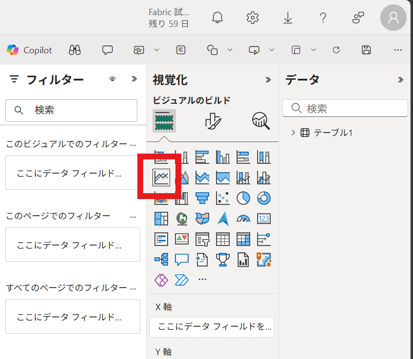
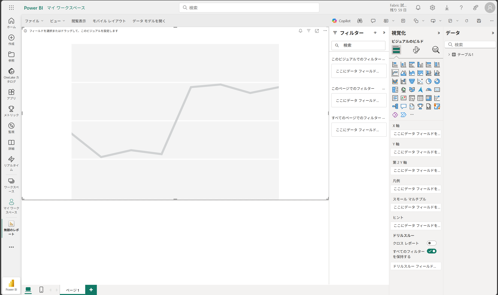
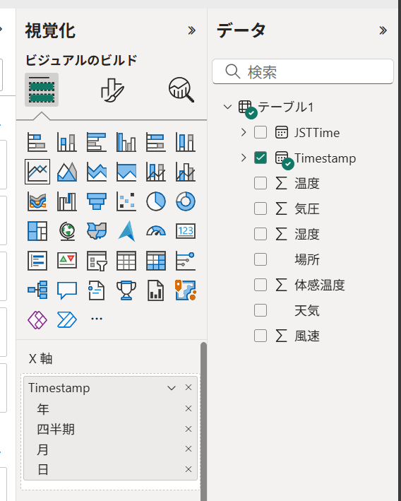
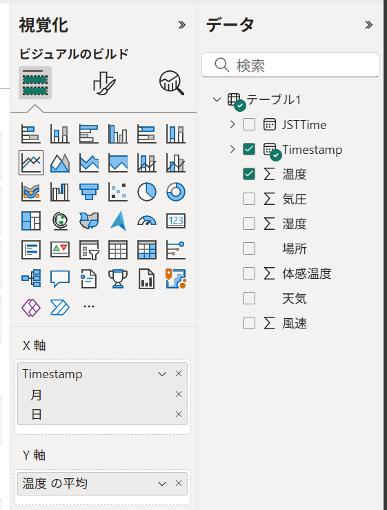
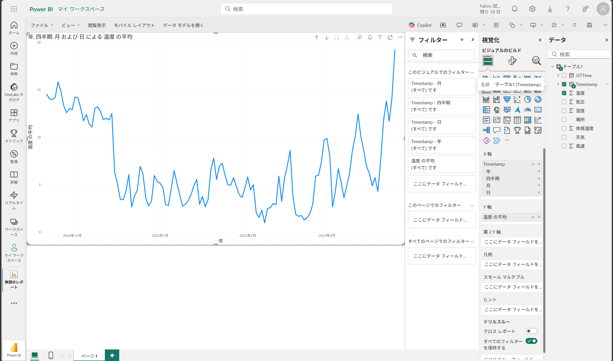
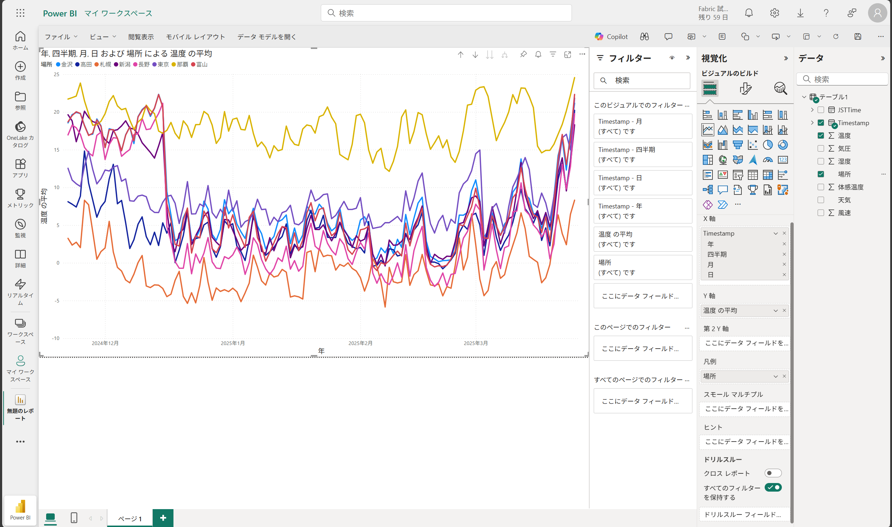
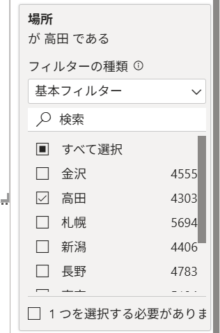
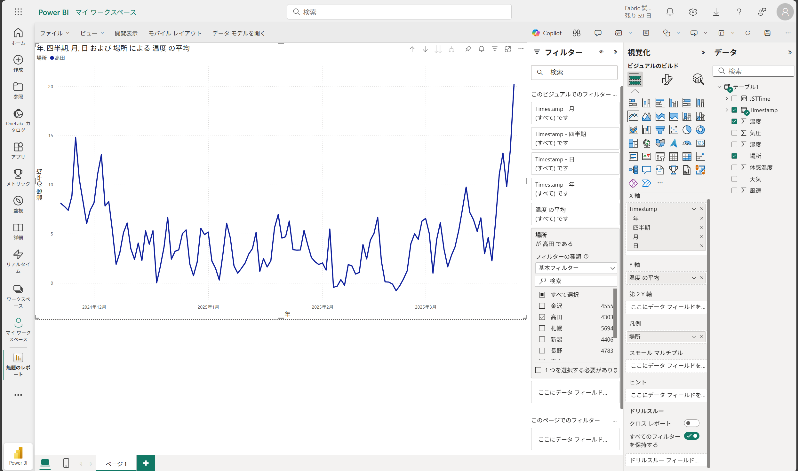
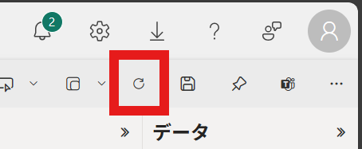

# レポートを作成する
今回は、気温の変遷を、地域ごとの折れ線グラフで表現します。

## 折れ線グラフを作成する
1. 画面右にある「視覚化」バーから折れ線グラフクリックし、レポートに配置します

2. 見やすいように、グラフの角をドラッグして大きさを調整します

3. 画面右にある「データ」バーの「テーブル1」を展開します
4. データバーにある「Timestamp」をX軸にドラッグします。範囲が広すぎる場合は、「年」「四半期」「月」の部分を削除します。

> [!NOTE]
> Power BI サービスでは、世界標準時（UTC）のみ表示でき、日本時間（UTC+9h）に変更することはできません。 
> 前もって実際の時間に9時間加算した列を作って置き、これをX軸に配置することで、疑似的に日本時間として反映させることはできます。
5. 同様に、「温度」データをY軸にドラッグします
6. ドラッグしたデータの「v」をクリックし、「温度の平均」に設定します

7. 設定した値で、グラフが反映されます

## 地域ごとにグラフ化する
1. 「凡例」の欄に「場所」データをドラッグすると、地域ごとに分割してグラフ化されます

## フィルターをかける
1. 画面右にある「フィルター」バーの「場所」をクリックします
2. 「高田」にチェックを入れます

3. レポートに、高田の気温のみ表示されます

## データを更新する
1. 元データがリアルタイムで更新される場合、画面右上の更新マークをクリックすると、レポートが最新の情報に更新されます

## これで、レポートの作成は完了です
---
[01-データを接続する](./c-01-connectdata.md) ⬅️ |[🏠](./README.md) | ➡️ [03-公開する](./c-03-publish.md)
