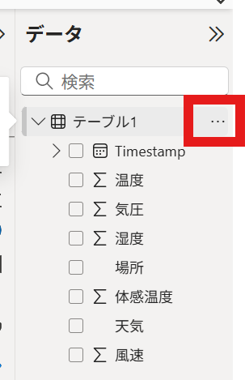
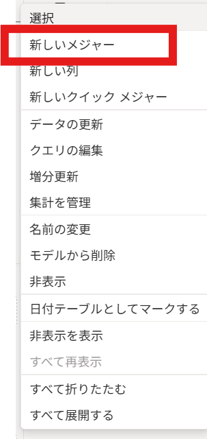
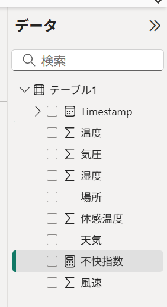
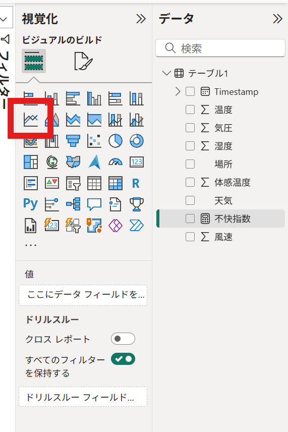
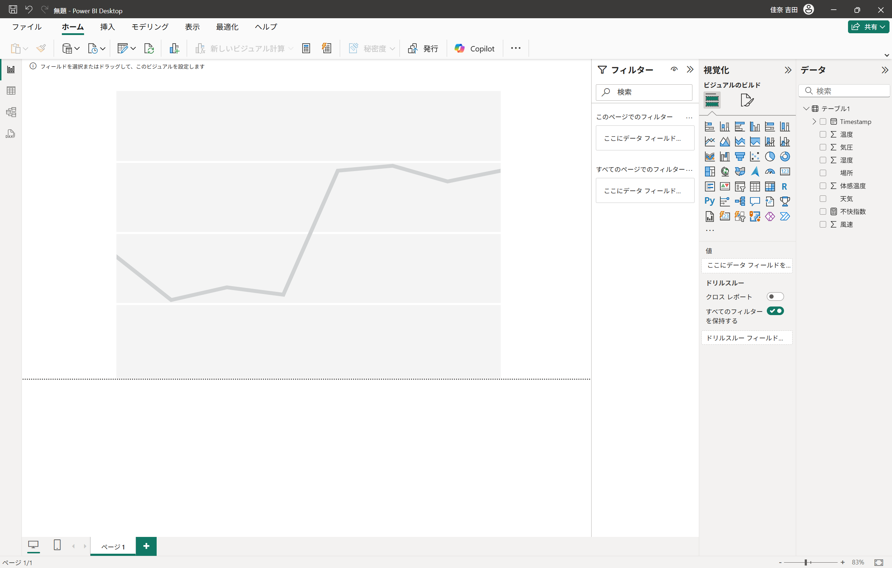
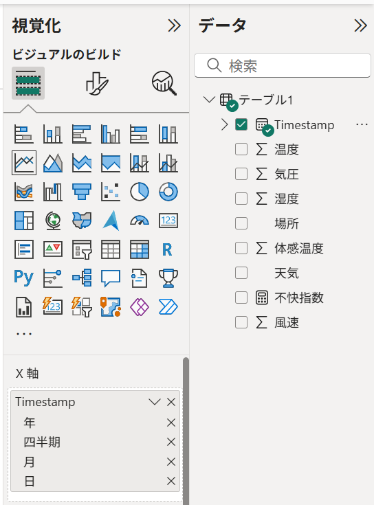
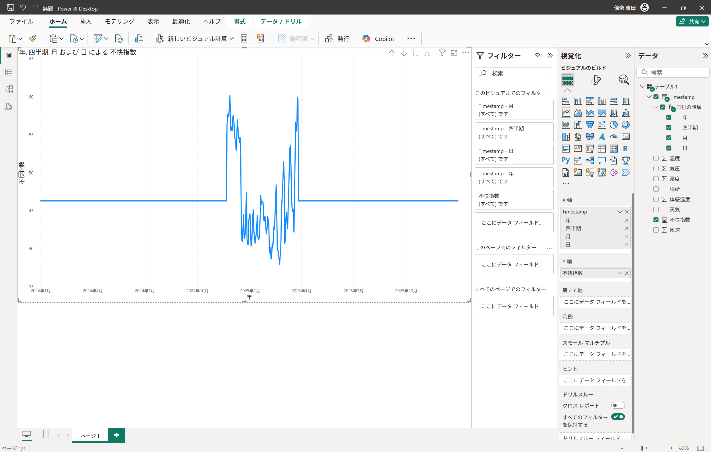
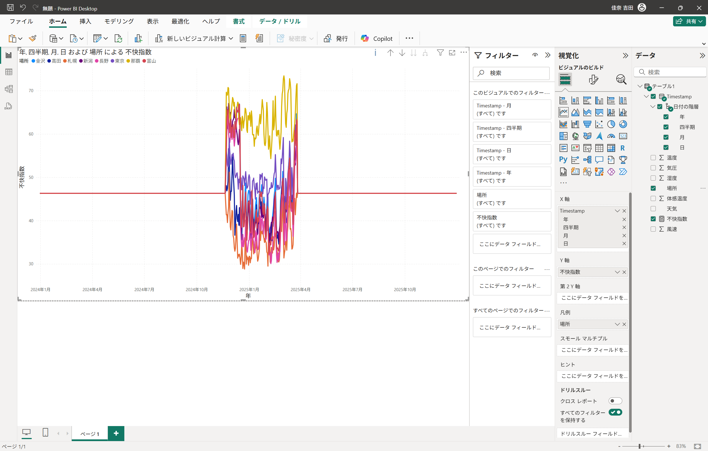

# レポートを作成する
Power BI Desktopでは、Power BIサービスよりも複雑な計算もレポートに反映させることができます。<br>
ここでは、各地の気温と湿度から、不快指数を計算しましょう。<br>

> [!NOTE]
> 不快指数とは夏の蒸し暑さを数量的に表した指数で、温熱指標の一つです。<br>
> 以下の計算式を使って、数値化していきます
> ```
> 不快指数 = 0.81*T + 0.01H * (0.99T-14.3) + 46.3
> ```
> ※ Tは乾球気温℃、Hは湿度％<br>
> 今回は秋~春のデータですが、この数式を利用してレポートを作成していきます。<br>
> 参考:https://keisan.casio.jp/exec/system/1202883065

## 不快指数の項目を追加する
現在のデータに新しい列を追加します
1. 画面右の「データ」バーにある「テーブル1」にカーソルを当て、「・・・」をクリックします

2. 「新しいメジャー」をクリックします

3. 画面上の数式バーに、以下の数式を入力します
```
不快指数 = AVERAGE('テーブル1'[温度])* 0.81 + AVERAGE('テーブル1'[湿度]) * 0.01 * (0.99 * AVERAGE('テーブル1'[温度])- 14.3) + 46.3
```

4. 数式バーの左にある✓をクリックします
5. 画面右のデータバーに不快指数の項目が追加されます


## 折れ線グラフを作成する
1. 画面右にある「視覚化」バーから折れ線グラフクリックし、レポートに配置します

2. 見やすいように、グラフの角をドラッグして大きさを調整します

3. データバーにある「Timestamp」をX軸にドラッグします。

> [!NOTE]
> Power BI サービスでは、世界標準時（UTC）しか表示できませんが、Power BI Desktopでは日本時間（UTC+9h）で反映されます<br>
4. 先ほど作成した「不快指数」をY軸にドラッグします。グラフが反映されます。

5. 地域ごとにグラフを分割します。「場所」データを凡例にドラッグすると、地域別で確認ができます。


## 以上で、レポートの作成は完了です
このように、Power BI Desktopではメジャー機能を使って複雑な計算をレポートに反映させることができます。

---
[01-データを接続する](./d-01-connectdata.md) ⬅️ |[🏠](./README.md) | ➡️ [03-見た目を変更する](./d-03-design.md)
